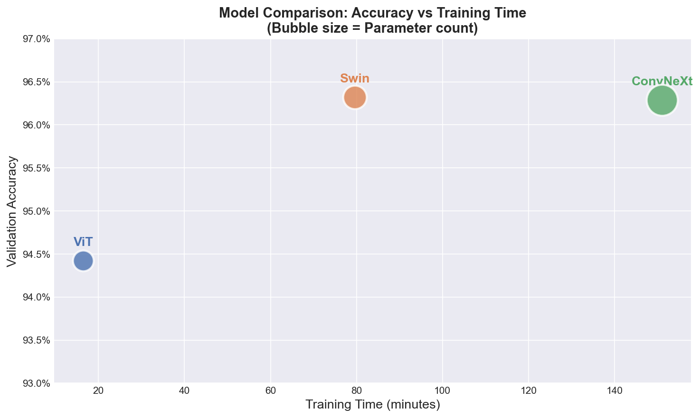
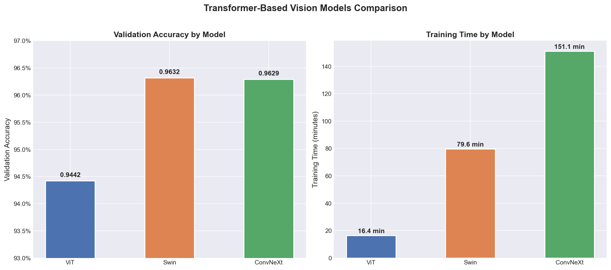
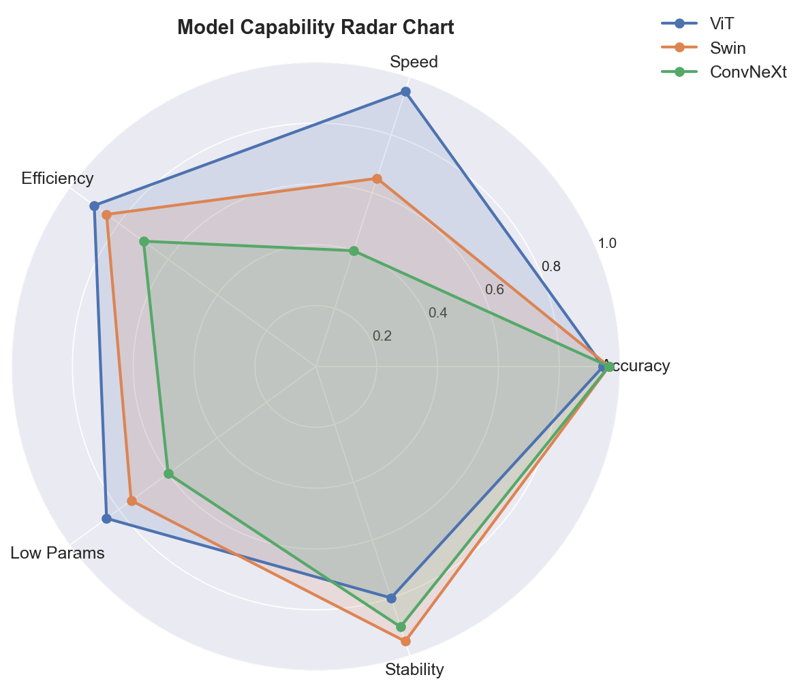
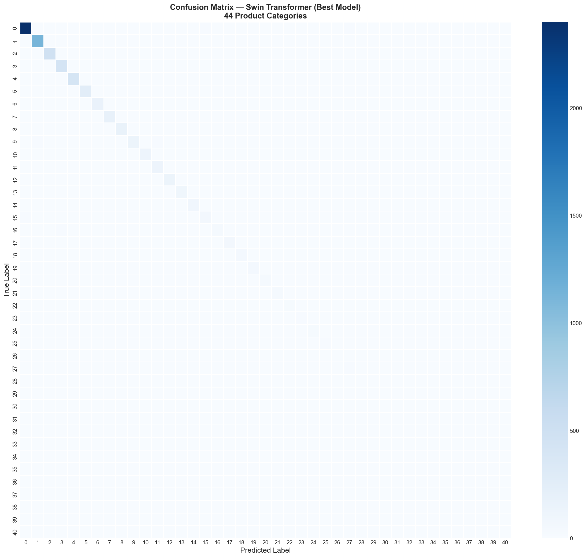

# BoolArt Image Classification — ViT vs Swin vs ConvNeXt

## Project Overview

This project tackles a 44-class image classification problem from the **Kaggle BoolArt Image Classification Competition** by comparing three modern pretrained vision backbones via transfer learning: **ViT (Vision Transformer)**, **Swin Transformer**, and **ConvNeXt**. Rather than just chasing the highest accuracy, the goal is to evaluate the real-world trade-off each architecture makes between **accuracy, training speed, and parameter efficiency** — the kind of decision that actually matters when picking a backbone for production.

**Best Result: Swin Transformer — 96.32% Validation Accuracy**

## Dataset

- **Source:** [Kaggle BoolArt Image Classification Competition](https://www.kaggle.com/competitions/boolart-image-classification)
- **Training set:** 35,551 labelled images, split 80/20 into train (28,440) / validation (7,111)
- **Test set:** 8,889 images (labels hidden)
- **Classes:** 44
- **Input:** RGB images resized to 224×224

## Project Pipeline

Raw Images → Augmentation (Resize / Flip / Rotation / Normalize) → Fine-tune ViT / Swin / ConvNeXt (timm, pretrained) → Compare Accuracy vs Speed vs Params → Capability Radar → Confusion Matrix (Best Model) → Kaggle Submission

---

## 1. Model Setup

All three models were fine-tuned from ImageNet-pretrained weights using identical hyperparameters, so differences in results come from architecture alone.

| | ViT | Swin | ConvNeXt |
|---|---|---|---|
| timm ID | `vit_small_patch32_224` | `swin_tiny_patch4_window7_224` | `convnext_small` |
| Params | 22.1M | 28.3M | 49.5M |
| Image Size | 224×224 | 224×224 | 224×224 |
| Epochs | 5 | 5 | 5 |
| Optimizer | Adam (lr=1e-4) | Adam (lr=1e-4) | Adam (lr=1e-4) |

---

## 2. Training Comparison

  
  

Swin reaches the highest validation accuracy (96.32%) in a fraction of ConvNeXt's training time (79.6 vs 151.1 minutes). ViT trains the fastest by far (16.4 minutes) but trails about 2pp behind on accuracy. ConvNeXt's extra parameters and more than double the training time over Swin don't translate into a corresponding accuracy gain — a clear case of diminishing returns past a certain model capacity for this dataset size.

---

## 3. Capability Radar

  

No single architecture dominates across every dimension. Swin offers the most balanced profile — strong accuracy and stability without sacrificing too much speed. ViT wins decisively on speed and efficiency but gives up the most accuracy. ConvNeXt trades both speed and parameter efficiency for a marginal, and ultimately not very rewarding, stability gain.

---

## 4. Confusion Matrix — Best Model (Swin Transformer)

  

With 96.32% accuracy across 44 classes, the confusion matrix is strongly diagonal — Swin separates most categories cleanly. The remaining misclassifications are not spread randomly; they concentrate in a small number of visually similar classes, suggesting the residual error comes from genuine visual ambiguity between certain categories rather than a systemic weakness in the model.

---

## 5. Results

| Model | Params | Best Val Accuracy | Training Time |
|---|---|---|---|
| ViT | 22.1M | 94.42% | 16.4 min |
| **Swin** | **28.3M** | **96.32%** | **79.6 min** |
| ConvNeXt | 49.5M | 96.29% | 151.1 min |

**Swin Transformer delivers the best accuracy-efficiency trade-off** — the highest validation accuracy of the three, using ~43% fewer parameters than ConvNeXt and less than half its training time.

---

## Tech Stack

`PyTorch` · `timm` · `scikit-learn` · `pandas` · `matplotlib` / `seaborn`

